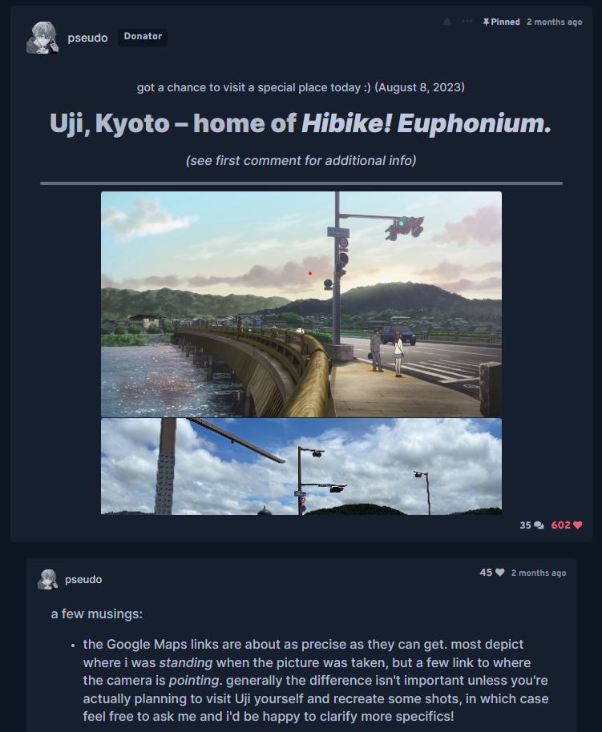
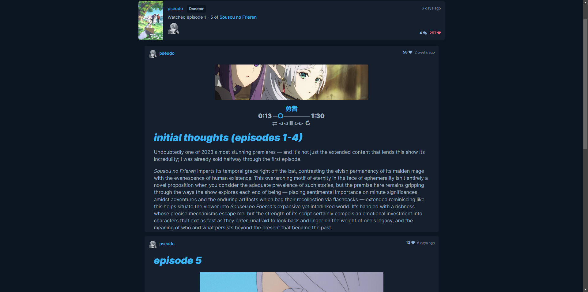

# AniList Enhanced Typography

Enhance your AniList reading experience with improved font sizes and styles.

## Installation

### Method 1: Using a Userscript Engine

1. Install a Userscript Engine:
   - [Tampermonkey](https://www.tampermonkey.net/)
   - [Violentmonkey](https://violentmonkey.github.io/get-it/)
   - [Greasemonkey](https://addons.mozilla.org/en-US/firefox/addon/greasemonkey/)
2. Install the user script from [here](./dist/anilist-enhanced-typography.user.js?raw=1).

### Method 2: Manual Installation

If you prefer not to use a userscript engine, you can manually apply the [`style.css`](./dist/style.css) to your browser.

## Screenshots

## Contribution

Contributions to this project are welcomed!
